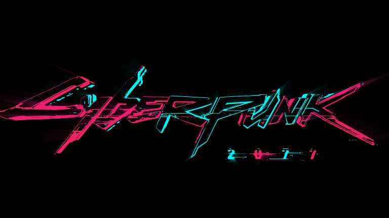
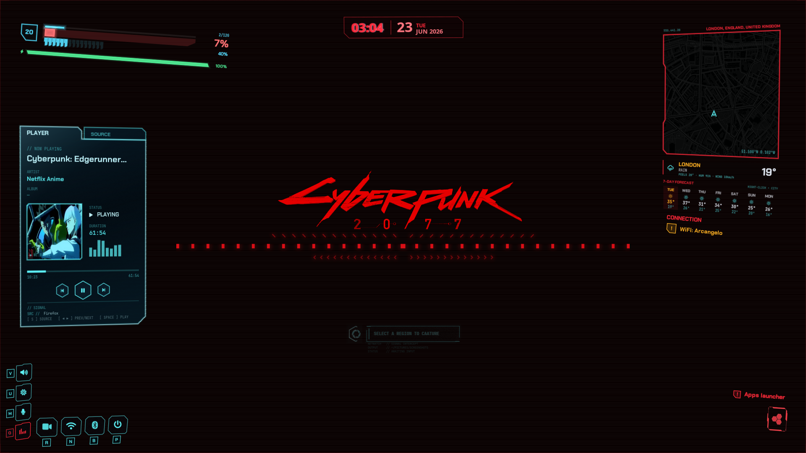
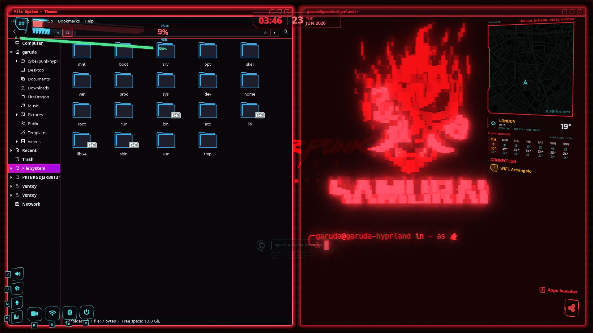
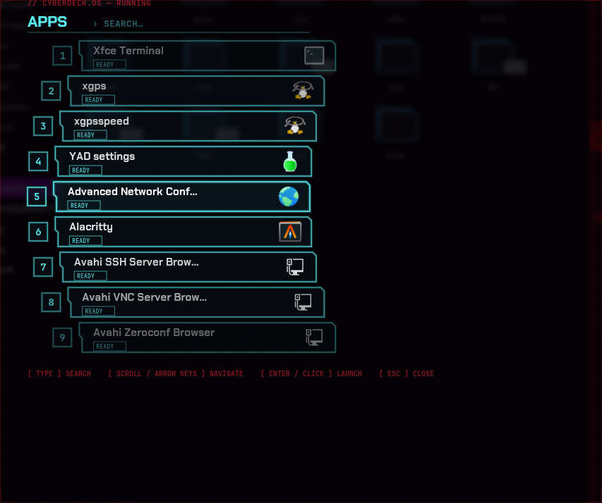
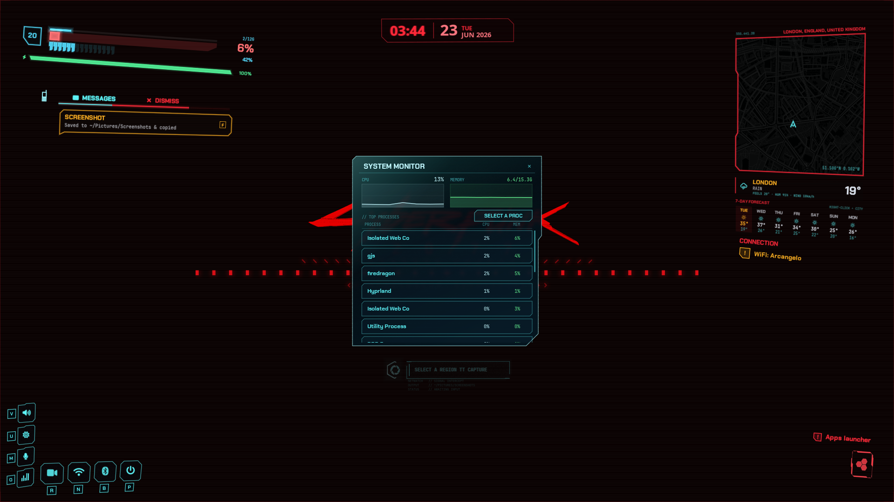
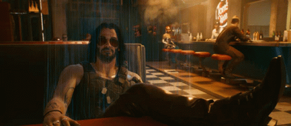
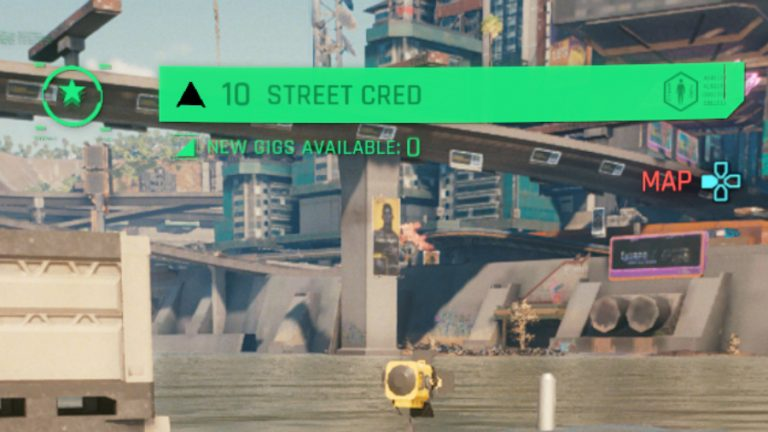

<div align="center">




<p align="center">
  
  
  
  
  
</p>

### **A Hyprland *netrunner* rice with 3D-tilted cairo HUD and components on AGS v3 / Astal**


</div>


# // Theme Showcase

<table border="0">
  <tr>
    <td></td>
    <td></td>
  </tr>
  <tr>
    <td></td>
    <td></td>
    <td></td>
  </tr>
</table>

### Video preview


https://github.com/user-attachments/assets/71fe2318-b9b2-4550-96dc-5a3f9f480223

---


## ⌁ Welcome to Night City::



This is a complete Cyberpunk 2077 themed desktop for **Hyprland**. The HUD is made with AGS script (`core.ts`) that draws everything with usage of cairo to create perspective-tilted panels, angular red-neon glass, segmented health bars, and glitch transitions to completely mimick the in-game UI such as animations and components aswell as much as possible.

<br clear="right"/>

### Highlights

- **Health bars** -> The in-game UI bars meant for Health, Stamina, RAM and Level are copied to provide system monitors:
  - The level badge provides current CPU temperature in Cº, if sensors fail or null it returns the system uptime
  -  The Health bars provide average usage in % of CPU load using /proc/stat
  -  The RAM bars...well they provide RAM Memory usage, with ramStat()
  -  the top bar on health for experience, provides the current filesystem storage as `Used/Total` 
  -  The Stamina bar provides the current battery level (if AC, will just stay at 100%)

- **Corner widgets** -> Renders the same UI style of the game UI shortcuts like Radio, Vehicle, Phone, Cyberware item etc
  -  Radio shortcut as Music Player (Toggleable by clicking, or SUPER + SHIFT + O)
  -  System controls for rest of shortcuts like Brightness, Volume, Microphone, Wifi, Bluetooth, Record Screen
- **Minimap** -> Recreates the Minimap from the HUD exactly the same as in-game, showing a random location from `city.json`  
  -  Weather widget below minimap: retrieves the weather forecast for the next 7 days from location at `city.json` using Open Meteo API (Right click to change city location)
  -  Network notification: Displays current WiFi/Etherned connected and SSID, or Offline Status

- **Weapon/Item** -> The bottom-right hud that shows weapon/ammo in-game
  -  Shows App Launcher, with a custom icon gathered from the design concepts of Cyberpunk 2077
  -  App Launcher shows a custom launcher that mimicks the Kiroshi Scanner, with audio and animations and the same shape of the 'quickhacks' frames.

- **KILL MODE** -> Starts an animated overlay similar to Kiroshi aswell, click on any app to forcekill it (Toggleable by SUPER+SHIFT+K)
- **Screen Recording** -> Starts recording the active screen, and with the same HUD components from in-game when acessing cameras from quickhacks (Toggleable by SUPER+SHIFT+R)
- **Music player** -> Opens/Closes the Media Player, designed with a tilted glassy-look frame similar to in-game panels. (Toggleable by SUPER+SHIFT+O)
- **Quickshell lockscreen** -> ANimated loginscreen with qs, simulating a NetWatch controlled terminal.
- **cool-retro-term** -> Autoinstalls Cool-Retro-Term by Swordfish90, and sets a 'Netrunner' profile for default, in same style of the terminal windows in-game, along with an optional fish installation and 'SAMURAI' banner.

---

## ⌁ Video previews

<table>
  <tr>
    <td width="50%" align="center">
      <b>KILL MODE</b><br/>
      <video src="https://github.com/user-attachments/assets/6fdc53f3-2517-4bd6-a8cf-f27db5d72823" controls width="100%"></video>
          </td>
    <td width="50%" align="center">
      <b>CONTROL MODALS</b><br/>
            <video src="https://github.com/user-attachments/assets/5ce0b689-a468-4cfd-b567-e35b531ac1ea" controls width="100%"></video>
          </td>
  </tr>
  <tr>
    <td width="50%" align="center">
      <b>APPS LAUNCHER</b><br/>
      <video src="https://github.com/user-attachments/assets/b59c9a22-def2-4aef-b0ba-f3c7f6a79824" controls width="100%"></video>
    </td>
    <td width="50%" align="center">
      <b>MUSIC PLAYER</b><br/>
      <video src="https://github.com/user-attachments/assets/173695f0-2488-49e8-9f54-a413fb04811a" controls width="100%"></video>
     </td>
  </tr>
  <tr>
    <td width="50%" align="center">
      <b>SCREENSHOT / CAPTURE</b><br/>
      <video src="https://github.com/user-attachments/assets/3e29cdbb-b681-4d5d-ab3a-3e57cde5fdb5" controls width="100%"></video>
    </td>
  </tr>


</table>


---

## ⌁ Requirements

- **Arch Linux** (the installer uses `pacman`)
- **Hyprland ≥ 0.55** (this theme uses custom titlebars that need 0.55's plugin API; optional though, the rest of theme isn't affected)
- An **AUR helper** — `yay` or `paru` (Always check PKGBUILD btw)
- A running Hyprland session (so theming + first-run setup can apply)

---

## ⌁ Install

```bash
git clone https://github.com/ARCANGEL0/Cyberpunk-Hyprland.git 
cd Cyberpunk-Hyprland
chmod +x install.sh
./install.sh
```

The installer is interactive and will:

1. **Dependencies** — scan + install missing repo and AUR packages.
2. **AGS runtime** — Installs and symlink the binary and resolve astal/GJS imports.
3. **Fonts** — install bundled Chakra Petch + Rajdhani.
4. **Lockscreen** — set up quickshell, qt6, and PAM auth.
5. **cool-retro-term** — download AppImage and configure the netrunner profile, and optionally installs fish shell.
7. **Theme source** — prepend `$cyberpunk` + `source=` to `hyprland.conf`.
8. **Conflicts** — scan and comment clashing keybinds, stale options, and overridden config blocks, to avoid keybinds being duplicated.
9. **Apply** — Set the full theme for icons,cursor,kitty, kvantum, build the custom hyprbars plugin, and reload Hyprland.

> Want to preview what would be installed without changing anything? `./install.sh --dry-run`

---

## ⌁ Keybinds

The theme modifier is **`$themeMod = SUPER + SHIFT`** (change it at the top of `theme.conf`). Open the full cheat-sheet with all keybinds anytime with **`SUPER+SHIFT+H`**.

### HUD & widgets

| Keybind | Action |
| --- | --- |
| `SUPER` / `SUPER + Space` | App launcher |
| `SUPER + SHIFT + Z` | Toggle HUD above / below windows |
| `SUPER + SHIFT + V` | Volume modal |
| `SUPER + SHIFT + U` | Brightness modal |
| `SUPER + SHIFT + M` | Microphone modal |
| `SUPER + SHIFT + O` | Music player |
| `SUPER + SHIFT + N` | Wi-Fi modal |
| `SUPER + SHIFT + B` | Bluetooth modal |
| `SUPER + SHIFT + P` | Power menu |
| `SUPER + SHIFT + W` | Weather |
| `SUPER + SHIFT + Y` | Battery modal |
| `SUPER + SHIFT + C` | CPU / RAM / system modal |
| `SUPER + SHIFT + H` | Keybind help |

### System & capture

| Keybind | Action |
| --- | --- |
| `SUPER + SHIFT + T` | Netrunner terminal (cool-retro-term) |
| `SUPER + SHIFT + S` | Screenshot (region) |
| `SUPER + SHIFT + R` | Start / stop screen recording |
| `SUPER + SHIFT + K` | **Kill mode** (click a window to kill · `ESC` exits) |
| `SUPER + SHIFT + L` | Lock screen |
| `SUPER + D` | Peek desktop (hide windows) |

### Window management

| Keybind | Action |
| --- | --- |
| `SUPER + SHIFT + F` | Fullscreen toggle |
| `SUPER + F` | Float / tile toggle |
| `SUPER + ← → ↑ ↓` | Move focus |
| `SUPER + SHIFT + ← → ↑ ↓` | Move window |
| `CTRL + SHIFT + ← → ↑ ↓` | Resize window |
| `SUPER + 1…0` | Switch workspace (with the glitch transition) |
| `ALT + SHIFT + 1/2/3/4/5...` | Send window to workspace |
| 3-finger swipe (If using notebook)  ← / → | Previous / next workspace |

---

## ⌁ Layout

```
cyberpunk/
├─ core.ts              # HUD entry point (AGS / astal / GJS)
├─ theme.conf          # Hyprland full theme
├─ install.sh          # interactive installer
├─ components/
│  ├─ modules/         # every widget (monitors, sidepanel, dock, modals, anim, …)
│  └─ style/           # cyber.scss and cyber.css
├─ scripts/            # launcher, screenshot, screenrecord, overkill, ws, terminal, and other used scripts.
├─ quickshell/         # Login screen using quickshell
├─ city.json           # City.json with the provided location, used for minimap and weather forecast
└─ assets/             # fonts, cursor, icons, kitty, kvantum, hyprbars, cool-retro-term
```

## TODO List

- [x] Add modal controls like CPU/RAM monitors, battery modals etc.
- [x] Draw HUD on N different monitors
- [x] Add same notifications from CP2077 messages and add official audios from game
- [ ] Add "+ Street Cred" animation when installing new apps from pacman 
  <br>
- [ ] Add more notification chips on HUD such as 'AUR Update Available!'.
      ...
---

## ⌁ Credits

- Built on **[Hyprland](https://hypr.land)**, **[AGS / Aylur's GTK Shell](https://github.com/Aylur/ags)**, and **[astal](https://github.com/Aylur/astal)**.
- Lockscreen on **[quickshell](https://quickshell.org)**.
- Terminal: **[cool-retro-term](https://github.com/Swordfish90/cool-retro-term)**.
- The custom titlebars are a small cairo-bevel patch over Hyprland's **hyprbars** plugin, from original hyprbars by the Hyprland project.

<div align="center">

## ❤️ Support

 ### if you enjoy the project and want to support future development:

[](https://github.com/ARCANGEL0/EVA)
[](https://github.com/ARCANGEL0)
<br>

<a href='https://ko-fi.com/J3J7WTYV7' target='_blank'></a>
<br>
<strong>Hack the world. Byte by Byte.</strong> ⛛ <br>
𝝺𝗿𝗰𝗮𝗻𝗴𝗲𝗹𝗼 @ 2026


</div>
